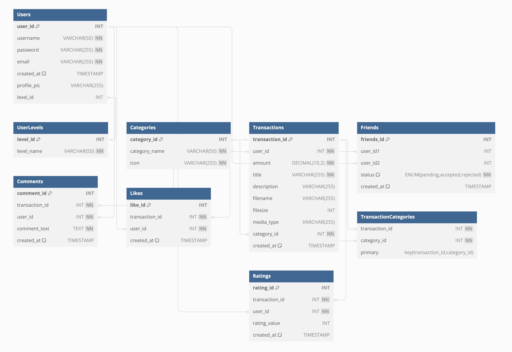

# Duckjet tracket
<del>Share your spendings with your friends and let them see how fast your money dissapears :D<del>
Media Sharing app with borrowed server side from Metropolia UAS teachers

## Link for the project (Works only on Metropolia servers / VPN)
<https://users.metropolia.fi/~khaic/K2024/react-k2024/>

## Technologies used:
### Projects client tech-stack: 
- React
- TypeScript 
- Vite
- TailwindCSS

### Projects server tech-stack:
- GraphQL
- TypeScript
- RestAPI

### Database diagram image

## Functionalities of the application
#### Main functionalities
- Register
- Login / Logout
- View Feed
- Create Expense / Transaction
- Post Expense / Transaction
- Modify Expense / Transaction

#### Additional functionalities

- Toggle systems or browsers appearance to change to dark/white mode

## Faced problems / Bugs and their solutions (or I just gave up on them) 

## References / Graphic inspos
### React / Tailwindcss component libraries
- Material Tailwindcss
- Flowbite Tailwindcss 
